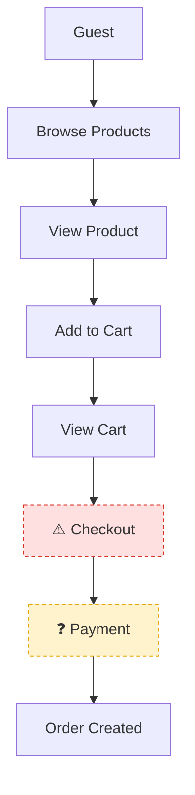

# Flowchart Skill

## Purpose

Maintain a single, living Mermaid flowchart of the flow being built or modified. The chart visualizes the flow and flags nodes where a gap or flaw might form, so weak points are easy to spot and reason about.

## Source of Truth

One canonical file per feature: `docs/flows/<feature>-flow.md`

This file is the single home for the chart:

| Workflow | Role |
|----------|------|
| `/brainstorm` | Creates the flow during design; marks `❓` gaps |
| `/plan` | Reads and refines it; embeds it in the plan |
| `/gate` | Maps security/quality findings → `⚠️` flaws |
| `/review` | Maps code findings → `⚠️` flaws |

Never scatter copies into individual workflow docs. Everyone reads from and writes back to `docs/flows/`.

## File Format

```markdown
# Flow: [Feature Name]

> Created: YYYY-MM-DD · Last updated: YYYY-MM-DD (by /<workflow>)



## Gaps & Flaws

| Node | Flag | Note |
|------|------|------|
| Checkout | ⚠️ flaw | No auth check before order creation |
| Payment | ❓ gap | Payment method not specified |
```

## Markers

| Flag | Meaning | Source |
|------|---------|--------|
| `❓` amber (`:::gap`) | **Gap** — missing/unknown: a requirement not yet specified | brainstorm, plan |
| `⚠️` red (`:::flaw`) | **Flaw** — confirmed problem: design/security/code issue | gate, review |

Marker rules:

- Flag a node by prefixing its label — `["❓ Payment"]` or `["⚠️ Checkout"]` — and adding the matching `:::` class.
- Every flagged node MUST have a matching row in the "Gaps & Flaws" table with a one-line note: *where* (the node) + *why* (what's missing or what's wrong).
- One flag per node max. If both gap and flaw apply, prefer `⚠️` — a confirmed flaw outranks an open gap.
- The note is one line, specific, tied to that node. No vague "needs work".

## Rendering Rules (Readability)

- **One primary direction** — top-down (`flowchart TD`) unless the flow is naturally horizontal.
- **No crossing edges** — reorder nodes or split a sub-flow if a crossing is unavoidable.
- **No edge through a node.**
- **One purpose per node** — a node is one action, state, or decision. Split "Validate + Calculate + Save" into three.
- **≤4 branches per decision** — more than that → extract a sub-flow.
- **Backward edges only for intentional loops** (retry, re-validate). Mark them clearly.
- **Keep the main flow ≤ ~15 nodes** — grow past that → parent flow + sub-flows.
- Flagged nodes must be visually distinct from confirmed nodes — never let `❓`/`⚠️` look like a normal node.

## Update Rules

- **Incremental.** Never rebuild the chart from scratch for a small change. Insert the new node/edge, adjust only the affected part.
- **Never silently discard.** Confirmed requirements stay unless the new input directly contradicts them.
- **Resolve flags.** User clarifies a gap → clear the `❓` + remove its row. Flaw fixed → clear the `⚠️`.
- **Contradictions are flaws.** New info that conflicts with the flow updates the nodes AND adds a `⚠️` — never a silent overwrite.
- Bump the `> Last updated` line with the date and the workflow that changed it.

## Handoff

After every update, render the current chart (Mermaid block + Gaps & Flaws table) inline in chat. Never just say "flow updated" — show it.
